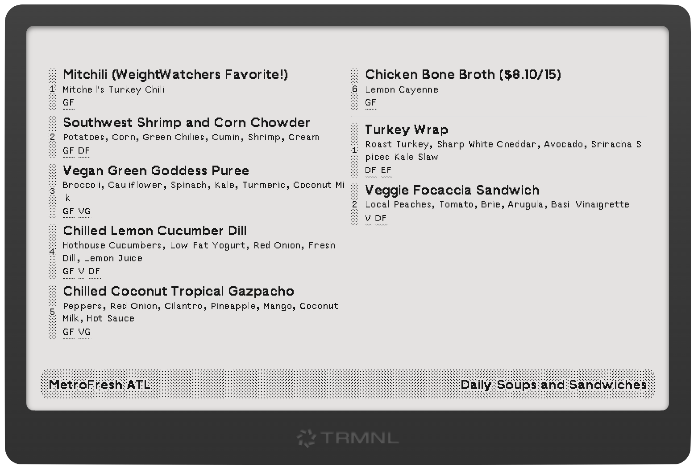

# trmnl-plugin-metrofresh-soups

An Express service that fetches the daily soup menu from MetroFresh via Menuat.

I built this because I’m a big fan of [MetroFresh](https://metrofreshatl.com), a local restaurant that updates its soup offerings daily. This plugin lets my [TRMNL](https://usetrmnl.com/) automatically show me what soups are available each day.



## Features

- Fetches daily soup menu from Menuat
- Returns formatted JSON with soup details
- Includes dietary information (GF, V, VG, DF, EF, NF)
- Filters out hidden or empty soup entries

## Setup

1. Install dependencies:
```bash
npm install
```

2. Start the server:
```bash
npm start
```

For development with auto-reload:
```bash
npm run dev
```

The server will run on port 3000 by default. You can change this by setting the `PORT` environment variable.

## API Endpoints

### GET /soups

Returns the current day's soup menu.

#### Response Format

```json
{
  "soups": [
    {
      "title": "Tomato Basil Soup",
      "description": "Classic tomato soup with fresh basil",
      "dietaryInfo": ["V", "GF"]
    },
    {
      "title": "Lentil Vegetable",
      "description": "Hearty lentil soup with seasonal vegetables",
      "dietaryInfo": ["V", "VG", "GF"]
    }
  ]
}
```

#### Dietary Information Codes

- GF: Gluten Free
- V: Vegetarian
- VG: Vegan
- DF: Dairy Free
- EF: Egg Free
- NF: Nut Free

#### Error Response

```json
{
  "error": "Error fetching soups"
}
```

## Dependencies

- express: ^4.18.2 - Web server framework
- axios: ^1.6.7 - HTTP client for making requests
- nodemon: ^3.0.3 - Development server with auto-reload (dev dependency)

## Environment Variables

- `PORT`: Server port (default: 3000)

## License

ISC

## Author

Diego Medina 